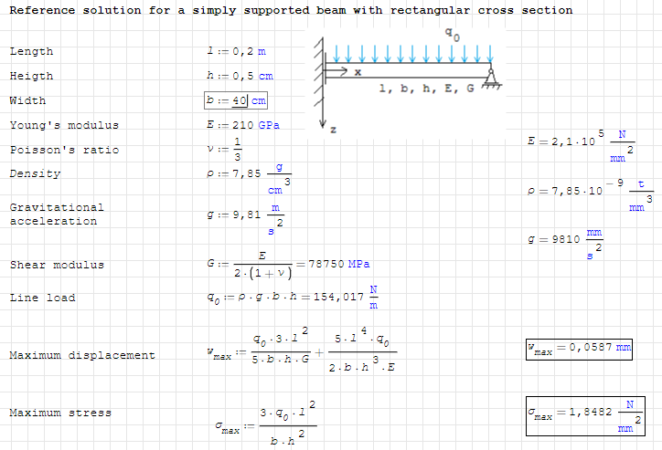

## Mesh Convergence with Shell Elements
Tested with CGX 2.19 / CCX 2.19

+ tri and quad  elements
+ linear or quadratic elements
+ full or reduced integration, incompatible shape functions

This example may help with selection of shell elements.

File                           | Contents    
:-------------                 | :------------- |
[shell.fbd](shell.fbd)         | Parametric pre- and postprocessing script for CGX   
[shell.inp](shell.inp)         | CCX input
[test.py](test.py)             | Python script to run the full example

| Unstructured tri mesh    | structured quad mesh    |
| :------------- | :------------- |
|  |

## Reference solution

[](https://de.smath.com/cloud/worksheet/BR4C5nLg)

## Mesh Convergence of the Normalized Results

The function `shell_conv()` in `test.py` creates a data file for each element type with the mesh density parameter setting, the number of nodes and the maximum displacement and stress values. An example (S3.txt):
```
# size NoN smax umax
200 8 0.513792 0.022522
100 12 0.616489 0.013121
50 20 1.2899 0.027729
20 84 0.792963 0.018026
10 178 1.03816 0.036069
```

The number of nodes refers to the expanded version of the shell elements.

The function `shell_plot()` in `test.py` generates the following plot of the results normalized by the analytical reference values.


## Results

All plots sorted by element type and nodal distance (division).

- The S3 element is too stiff and shows strange stress pattersn
- The S4R element can't represent bending, the stiffness results just from shear stiffness.
- The S8R element exhibits hourglassing if there is just one element over the cross section. Yet the stress values and maximum displacements at the plane of symmetry are acceptable
- S4, S6 and S8 converge well, while S4 is most efficient, S8 is least efficient in terms of precision versus number of nodes. Efficience in terms of computing time may be different.

| Type    | 200    | 100 | 50 | 20 | 10 | 5 
| :------------- | :------------- | :---- |:---- |:---- |:---- |:---- |
| S3 |  ||  ||
| S4 |  ||  ||
| S4R |  ||  ||
| S6 | |  ||  ||
| S8 | |  ||  ||
| S8R | |  ||  ||